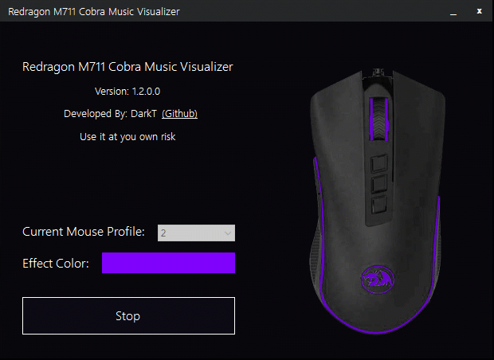

# Redragon Audio Visualizer
Redragon Audio Visualizer that give redragon products real time audio visualizer
the program require [Redragon SDK](https://github.com/D4rkTT/Redragon-RGB-SDK) if you wanna build it

## Supported Devices
- Redragon M711 Cobra

## Screenshot

## Download & Install

### Install Driver (First Time Only)
1- Download [libusb-filter-win32.rar]()

2- Extract `libusb-filter-win32.rar` and open `install-filter-win.exe`

3- Choose `Install a device filter` then choose like screenshot then `Install`

4- Wait untill done then close it
* You need to install driver again if you replugged the mouse

### Download Redragon Audio Viusalizer
1- Download [Latest Release](https://github.com/D4rkTT/Redragon-Audio-Visualizer/releases/download/1.0.0/Redragon.Audio.Visualizer.V1.0.0.rar)

2- Open `RedragonVisualizer.exe` then choose color and click `Start`

Enjoy ❤

## Build
If you want to build it, You will need 

1- Visual Studio 2017 or earler

2- [Redragon SDK](https://github.com/D4rkTT/Redragon-RGB-SDK)

3- build it then put SDK dll into build folder

## Donate
if you wanna to buy me a coffie or buy me a product to support it ☕❤
- Bitcoin: ``1sgPvUDBT8ZpXwvJAjSsqWPiebjxTdjX9``
- Ether:   ``0xdAcA9df277711Af20FA18b849471d50047D94B4b``
- USDD:    ``0xdAcA9df277711Af20FA18b849471d50047D94B4b``
